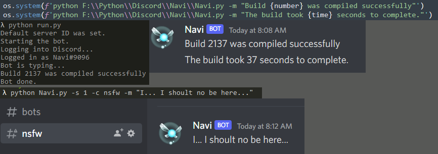

# Navi
Command line message bot for Discord.

### What is this
This is a Discord bot that allows you to pass simple commands to be sent to a discord server.

### Why?
Well I have probably way to many automated tasks and programs going on and I want those programs to send me simple reports on when they are done or if they need attention. 
Giving every program there own discord bot is kinda stupid, so let's make one central bot that all the programs can use.

### Requirements
Only real requirements are python 3.8 or newer, know how to setup and run discord bots as I wont be covering that and 
`pip install discord.py` 
I have also included a `requirements.txt` if you like... Kinda pointless for one lib but hay, why not.

### How to setup
First up, we need to go to [https://discord.com/developers/applications](https://discord.com/developers/applications "https://discord.com/developers/applications") and make a new bot and invite it to some servers. 
There is a `icon.png` in this repository you can use as an icon if you like. 
Now we need to download the `Navi.py` and `Discord.key` file from this repository. 
`Discord.key` is just a blank template file so you can just make a new file. 
Next we need to edit `Discord.key`, and place your bot API key in this file. 
Make sure your key is the only thing in this file, no other lines. 
Next we need to edit `Navi.py`. 
At the top of the script you will see some `# User variables` 
We need to edit the `BotKey = ` with the file path of our `Discord.key` we just made. 
If your just running Navi on it's own with `Discord.key` and `Navi.py` in the same folder together 
you can just replace this with `BotKey = "Discord.key"` 
However if you are using other programs to run Navi, like in my demo pic you will need to include an absolute file
path for your discord key. Absolute file paths need to have there \ escaped with \\\ like how it is already setup in the script. 
Below `BotKey = ` is `BotChannel = `. This is the default channel your bot will talk on. of course you can manually set what channel you want with a command but if you want to keep it nice and simple and your only using your bot on one server or channel then we can set our default channel here. 
Please remember that channels are case sensitive. So eg. General, general and GenEral are all totally different channels. The bot will give you an error if it can not find the channel you are trying to send to. 
After you have made and set your API Key, and saved all your settings in `Navi.py` we can save and close all of this and run the bot now. 

### Running the bot
There are lots of ways you can run the bot and if you just wanna TL;DR 
Simply run `python Navi.py -h` to see a list of commands you can use. 
With that out of the way first up we need to just run `python Navi.py` with no command arguments. 
This will log into your bot with the API key provided in the `Discord.key` file and print out a list of servers the bot is currently apart of. 
If you only have the bot on, or only plan on using the bot with one server, then as long as no errors were triggered by this we can proceed. 
If you do plan on using the bot on multiple servers, then make a note of the ID= number of the server you wish to talk on as we will need it for later. 
To use the bot in it's most simplest form, simply run `python Navi.py -m "Your message"` 
This will send `Your message` to server ID 0 (if you only have one server, that will be it) and it should show up in your default channel you set with `BotChannel = ` 
Simple enough. 
If you wanna get more complex with it you can run `python Navi.py -s 1 -c NSFW -m "I should not be here."` 
This will send the message to the NSFW channel on your 2nd server. You can mix and match these commands to your liking. 
You can now also send a fancy message like this `python Navi.py -s 1 -c NSFW -m "I should\nnot\nbe\nhere."` 
This will make a multi-line message where each word is on a new line but, all these lines will be sent as one 
singular message. Same as if you hit Shift+enter in the discord client when typing a message.  
`\n` is our special character for telling the bot to make a new line.<br?
If all your servers have a `Bots` channel then you don't need to specify the `-c` command you can just set `BotChannel = "Bots"` as your default channel in `Navi.py` 
If you only have one server but want to talk on different channels then you can supply the `-c` command without needing to set a server with the `-s` command. 
That covers most of it, you can see a full list of commands by running `python Navi.py -h` though. 
If you wish to ping your self, or anyone else, you can right click on a uses in the members color of your discord server, and select copy ID 
Then in your bot message You type send `<@USER_ID>` replacing USER_ID with the ID you just copied. This will automatedly build an @ ping for that user 
I wish you could just @ ping like normal but discords api is weird, getting the ID from a username is a pain, and the @ is treated like a string...

### "Bug"
"bugs" and not actual bugs as there is nothing I know about that prevent the script from running, just some weird things I don't know what I want to do about yet. 
The key thing is anything you send with the `-m ` command is stripped and converted as a single string. 
This means that things like `\n` newlines isn't working right now but also, some emojies and special characters don't work either. 
Right now this means its almost impossible for a user to submit a `-m ` command that brakes the bot or discord but it also means you cant do some other cool things. 
Emojies kinda work.. The built in default discord ones like `:eyes:` and `:grinning:` work fine. but I could never get custom emojies like `<:CustomEmojie:123456789>` to work.
